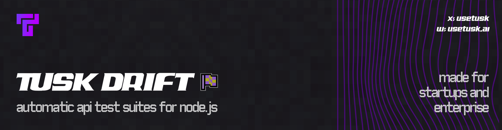

<p align="center">
  
</p>

<p align="center">
  <a href="https://www.npmjs.com/package/@use-tusk/drift-node-sdk"></a>
  <a href="https://opensource.org/licenses/Apache-2.0"></a>
  <a href="https://github.com/Use-Tusk/drift-node-sdk/commits/main/"></a>
</p>

The Node.js Tusk Drift SDK enables fast and deterministic API testing by capturing and replaying API calls made to/from your service. Automatically record real-world API calls, then replay them as tests using the [Tusk CLI](https://github.com/Use-Tusk/tusk-drift-cli) to find regressions. During replay, all outbound requests are intercepted with recorded data to ensure consistent behavior without side-effects.

## Documentation

For comprehensive guides and API reference, visit our [full documentation](https://docs.usetusk.ai/automated-tests/installation#setup).

## Requirements

Tusk Drift currently supports the following packages and versions:

- **HTTP/HTTPS**: All versions (Node.js built-in)
- **GRPC**: `@grpc/grpc-js@1.x` (Outbound requests only)
- **PG**: `pg@8.x`, `pg-pool@2.x-3.x`
- **Postgres**: `postgres@3.x`
- **MySQL**: `mysql2@3.x`
- **IORedis**: `ioredis@4.x-5.x`
- **GraphQL**: `graphql@15.x-16.x`
- **JSON Web Tokens**: `jsonwebtoken@5.x-9.x`
- **JWKS RSA**: `jwks-rsa@1.x-3.x`

If you're using packages or versions not listed above, please create an issue with the package + version you'd like an instrumentation for.

## Installation

### Step 1: Install the CLI

First, install and configure the Tusk Drift CLI by following our [CLI installation guide](https://github.com/Use-Tusk/tusk-drift-cli?tab=readme-ov-file#install). The CLI helps set up your Tusk configuration file and replays tests.

The wizard will eventually direct you back here when it's time to set up the SDK.

### Step 2: Install the SDK

After completing the CLI wizard, install the SDK:

```bash
npm install @use-tusk/drift-node-sdk
```

### Step 3: Initialize the SDK for your service

Refer to our [initialization guide](docs/initialization.md) to set up the SDK for your service.

### Step 4: Run Your First Test

Follow along our [quick start guide](docs/quickstart.md) to record and replay your first test!

## Troubleshooting

Having issues?

- Read our [troubleshooting doc](docs/troubleshooting.md)
- Create an issue or reach us at [support@usetusk.ai](mailto:support@usetusk.ai).

## Contributing

We appreciate feedback and contributions. See [CONTRIBUTING.md](/CONTRIBUTING.md).

## License

This project is licensed under the Apache License 2.0 - see the [LICENSE](LICENSE) file for details.
