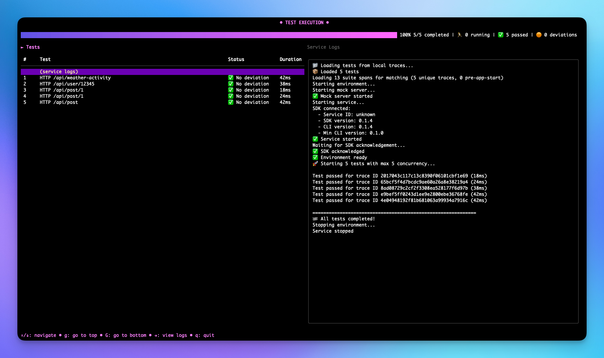

<p align="center">
  
</p>

<p align="center">
  <a href="https://opensource.org/licenses/Apache-2.0"></a>
  <a href="https://github.com/Use-Tusk/tusk-drift-sdk/commits/main"></a>
</p>

The Node.js Tusk Drift SDK enables fast and deterministic API testing by capturing and replaying API calls made to/from your service. Automatically record real-world API calls, then replay them as tests using the [Tusk CLI](https://github.com/Use-Tusk/tusk-drift-cli) to find regressions. During replay, all outbound requests are intercepted with recorded data to ensure consistent behavior without side-effects.

## Documentation

For comprehensive guides and API reference, visit our [full documentation](https://docs.usetusk.ai/automated-tests/installation#setup).

## Requirements

Tusk Drift currently supports the following packages and versions:

- **HTTP/HTTPS**: All versions (Node.js built-in)
- **PG**: `pg@8.x`, `pg-pool@2.x-3.x`
- **Postgres**: `postgres@3.x`
- **JSON Web Tokens**: `jsonwebtoken@5.x-9.x`
- **JWKS RSA**: `jwks-rsa@1.x-3.x`
- **GraphQL**: `graphql@15.x-16.x`

If you're using packages or versions not listed above, please create an issue with the package + version you'd like an instrumentation for.

## Installation

### Step 1: CLI Setup

First, install and configure the Tusk Drift CLI by following our [CLI installation guide](https://github.com/Use-Tusk/tusk-drift-cli?tab=readme-ov-file#install).

The wizard will eventually direct you back here when it's time to set up the SDK.

### Step 2: SDK Installation

After completing the CLI wizard, install the SDK:

```bash
npm install @use-tusk/drift-node-sdk
```

## Initialization

### Prerequisites

Before setting up the SDK, ensure you have:

- Completed the [CLI wizard](https://github.com/Use-Tusk/tusk-drift-cli?tab=readme-ov-file#quick-start)
- Obtained an API key from the [Tusk Drift dashboard](https://usetusk.ai/app/settings/api-keysgoogle.com)

Follow these steps in order to properly initialize the Tusk Drift SDK:

### 1. Create SDK Initialization File

Create a separate file (e.g. `tdInit.ts`) to initialize the Tusk Drift SDK. This ensures the SDK is initialized as early as possible before any other modules are loaded.

```typescript
// tdInit.ts
import { TuskDrift } from "@use-tusk/drift-node-sdk";

// Initialize SDK immediately
TuskDrift.initialize({
  apiKey: process.env.TUSK_DRIFT_API_KEY,
  env: process.env.ENV,
  logLevel: process.env.TUSK_DRIFT_LOG_LEVEL,
});

export { TuskDrift };
```

#### Configuration Options

<table>
  <thead>
    <tr>
      <th>Option</th>
      <th>Type</th>
      <th>Default</th>
      <th>Description</th>
    </tr>
  </thead>
  <tbody>
    <tr>
      <td><code>apiKey</code></td>
      <td><code>string</code></td>
      <td><b>Required.</b></td>
      <td>Your Tusk Drift API key.</td>
    </tr>
    <tr>
      <td><code>env</code></td>
      <td><code>string</code></td>
      <td><b>Required.</b></td>
      <td>The environment name.</td>
    </tr>
    <tr>
      <td><code>logLevel</code></td>
      <td><code>'silent' | 'error' | 'warn' | 'info' | 'debug'</code></td>
      <td><code>'info'</code></td>
      <td>The logging level.</td>
    </tr>
  </tbody>
</table>

### 2. Import SDK at Application Entry Point

In your main server file (e.g., `server.ts`, `index.ts`, `app.ts`), import the initialized SDK **at the very top**, before any other imports:

```typescript
// server.ts
import { TuskDrift } from "./tdInit"; // MUST be the first import

// ... other imports ...

// Your application setup...
```

> **IMPORTANT**: Ensure NO require/import calls are made before importing the SDK initialization file. This guarantees proper instrumentation of all dependencies.

### 3. Update Configuration File

Update the configuration file `.tusk/config.yaml` to include a `recording` section. Example `recording` configuration:

```yaml
# ... existing configuration ...

recording:
  sampling_rate: 0.1
  export_spans: true
  enable_env_var_recording: true
```

#### Configuration Options

<table>
  <thead>
    <tr>
      <th>Option</th>
      <th>Type</th>
      <th>Default</th>
      <th>Description</th>
    </tr>
  </thead>
  <tbody>
    <tr>
      <td><code>sampling_rate</code></td>
      <td><code>number</code></td>
      <td><code>1.0</code></td>
      <td>The sampling rate (0.0 - 1.0). 1.0 means 100% of requests are recorded, 0.0 means 0% of requests are recorded.</td>
    </tr>
    <tr>
      <td><code>export_spans</code></td>
      <td><code>boolean</code></td>
      <td><code>false</code></td>
      <td>Whether to export spans to Tusk backend or local files (<code>.tusk/traces</code>). If false, spans are only exported to local files.</td>
    </tr>
    <tr>
      <td><code>enable_env_var_recording</code></td>
      <td><code>boolean</code></td>
      <td><code>false</code></td>
      <td>Whether to enable environment variable recording and replaying. Recommended if your application's business logic depends on environment variables, as this ensures the most accurate replay behavior.</td>
    </tr>
  </tbody>
</table>

### 3. Mark App as Ready

Once your application has completed initialization (database connections, middleware setup, etc.), mark it as ready:

```typescript
// server.ts
import { TuskDrift } from "./tdInit";

// ... other imports ...

const app = express();

// Your application setup...

app.listen(8000, () => {
  // Mark app as ready for recording/replay
  TuskDrift.markAppAsReady();
  console.log("Server started and ready for Tusk Drift");
});
```

## Run Your First Test

Let's walk through recording and replaying your first trace:

### Step 1: Set sampling rate to 1.0

Set the `sampling_rate` in `.tusk/config.yaml` to 1.0 to ensure that all requests are recorded.

### Step 2: Start server in record mode

Run your server in record mode using the `TUSK_DRIFT_MODE` environment variable:

```bash
TUSK_DRIFT_MODE=RECORD node server.js
```

You should see logs indicating Tusk Drift is active:

```
[TuskDrift] SDK initialized in RECORD mode
[TuskDrift] App marked as ready
```

### Step 3: Generate Traffic

Make a request to a simple endpoint that includes some database and/or network calls:

```bash
curl http://localhost:8000/api/test/weather
```

### Step 4: Stop Recording

Wait for a few seconds and then stop your server with `Ctrl+C`. This will give time for traces to be exported.

### Step 5: List Recorded Traces

In your project directory, list the recorded traces:

```bash
tusk list
```

You should see output similar to:


Press `ESC` to exit the list view.

Need to install the Tusk CLI? See [CLI installation guide](https://github.com/Use-Tusk/tusk-drift-cli?tab=readme-ov-file#install).

### Step 6: Replay the Trace

Replay the recorded test:

```bash
tusk run
```

You should see output similar to:



**Success!** You've recorded and replayed your first trace.

## Troubleshooting

### Common Issues

#### No traces being recorded

1. **Check sampling rate**: Ensure `sampling_rate` in `.tusk/config.yaml` is 1.0
2. **Verify app readiness**: Make sure you're calling `TuskDrift.markAppAsReady()`
3. **Check endpoint paths**: Ensure your endpoint isn't in `exclude_paths`

#### Replay failures

1. **Enable service and CLI logs**:

   ```bash
   tusk run --debug
   ```

   Logs will be written to `.tusk/logs/`

2. **Test with simple endpoint**: Start with endpoints that only return static data

3. **Check dependencies**: Verify you're using supported package versions

#### Package compatibility issues

If you're using packages or versions not in our compatibility matrix, [contact our support team](https://google.com) for assistance.

## Integration Testing

For testing instrumentation functionality, use the dedicated npm scripts:

```bash
# Run only regular unit tests that do not require Docker
npm run test:unit

# Run only the integration tests that require Docker (will setup and teardown for you)
npm run test:int

# Run all tests
npm test
```

Integration tests live in files ending with `.test.int.ts` ("int" stands for
integration). Normal unit tests continue to use the `.test.ts`. This naming
scheme is because `.int.test.ts` would also match on `.test.ts`.

The http and fetch module are probably the only few that don't require spinning
up docker for their dependencies, those integration tests are instead done by
simply launching an express server.

Finally, please note that these commands don't accept arguments. If you want to
filter which files to run, you might want to do `npx jest xyz.test.ts` instead.

## License

This project is licensed under the Apache License 2.0 - see the [LICENSE](LICENSE) file for details.
